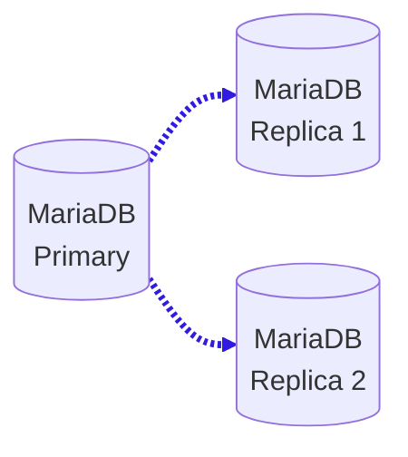
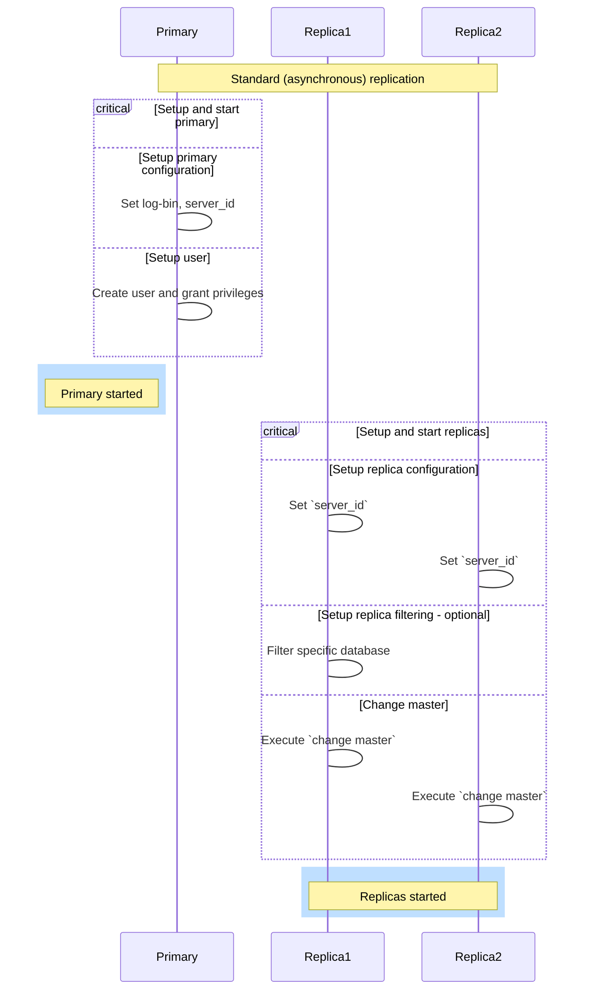
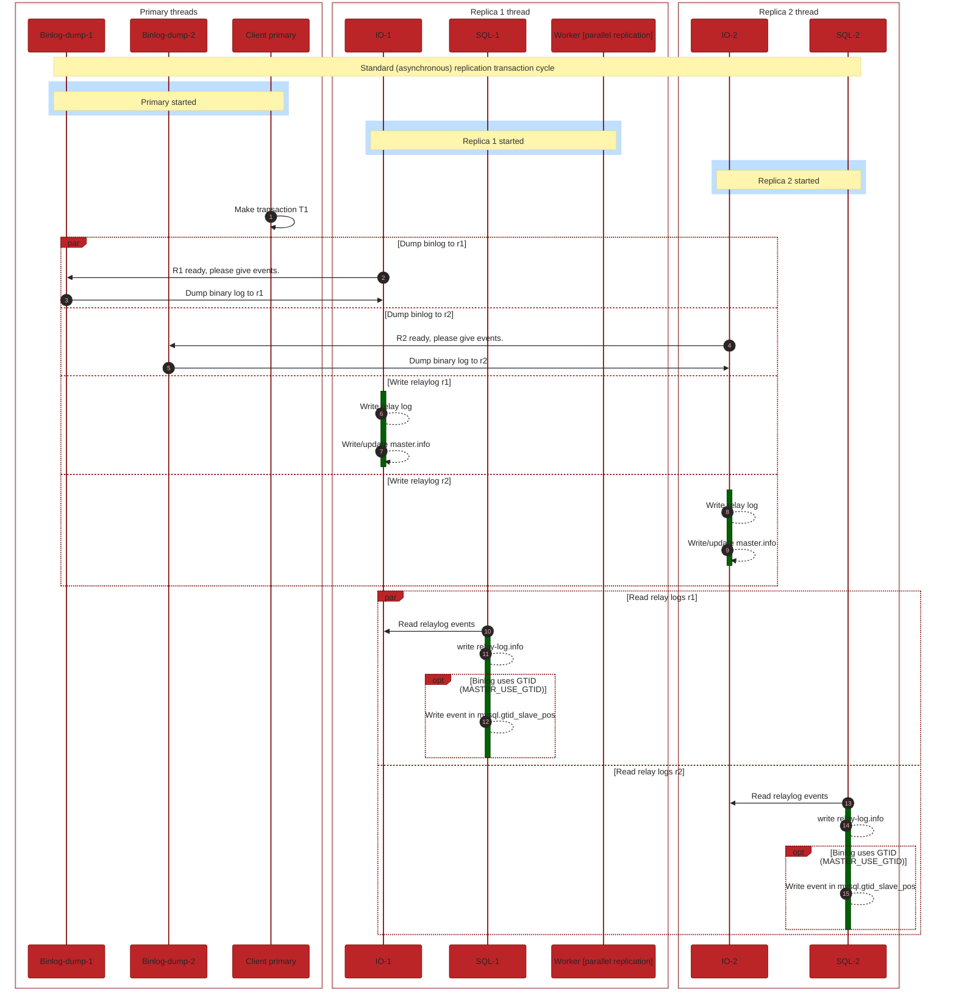
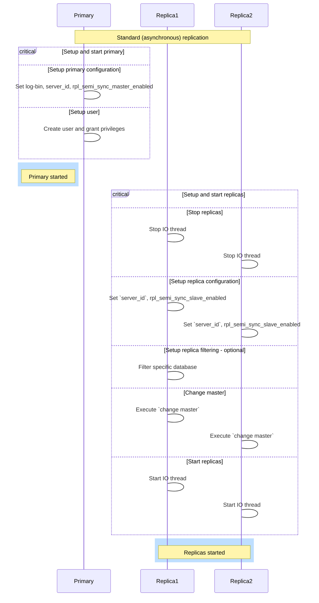
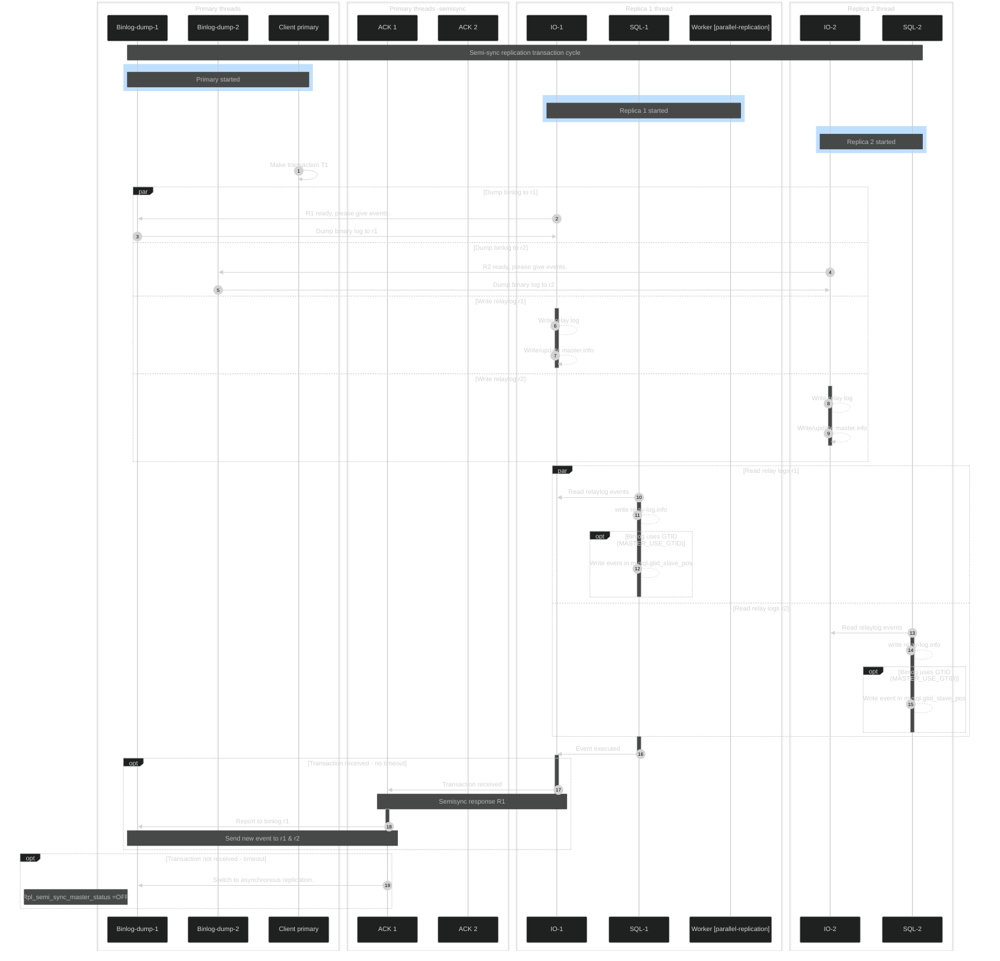

# MariaDB semi-sync replication using containers

In the last blog [MariaDB replication using containers](https://mariadb.org/mariadb-replication-using-containers/)
we showed how to properly replicate data in MariaDB using Docker containers.
We used standard or asynchronous or lazy replication.



In this blog we will visualise following:

1. Standard replication configuration
2. Standard replication transaction example
3. Semi-sync replication configuration
4. Semi-sync replication transaction example
5. Semi-sync demo example

## 1. Standard replication configuration
To configure the standard replication implemented in previous blog was straight forward:



## 2. Standard replication transaction

On thread level (see [replication-threads](https://mariadb.com/kb/en/replication-threads/)),flow of active transaction we can express as following:



Type of the replication is asynchronous that means that we don't have any feedback information from replicas,
that event has been successfully received by replica, as can be seen from picture.

## 3. Semi-sync replication configuration
To configure the semi-sync replication we need to stop replicase and set environment variables on primary and replicas.
On primary set `rpl_semi_sync_master_enabled` and on replicas set `rpl_semi_sync_slave_enabled`.



## 4. Semi-sync replication transaction example
Semi-sync should overcome that problem, with introducing additional primary thread , called ["ACK Receiver Thread"](https://mariadb.com/kb/en/replication-threads/#ack-receiver-thread).
Only one replica is needed to confirm, that it has received and logged the events, as showed on following picture:



## 5. Semi-sync demo example with containers
We will be using GTIDs as promised in last blog.
GTID is enabled automatically, however we need to update configuration on the replicas by adding `CHANGE MASTER TO master_use_gtid=slave_pos`.
This way replication will start at the position of the last GTID replicated to replica (seen from `gtid_slave_pos` system variable).
### 5.1 Start the cluster
```
```
### 5.2 Check containers
```bash
$ docker compose up
 docker ps
CONTAINER ID   IMAGE          COMMAND                  CREATED          STATUS                             PORTS                                       NAMES
bfaa9f47e2a0   mariadb:10.6   "docker-entrypoint.s…"   30 seconds ago   Up 28 seconds (health: starting)   0.0.0.0:3388->3306/tcp, :::3388->3306/tcp   mariadb-replica-2-semisync
b8b64e3c7bf7   mariadb:10.6   "docker-entrypoint.s…"   30 seconds ago   Up 29 seconds (health: starting)   0.0.0.0:3377->3306/tcp, :::3377->3306/tcp   mariadb-replica-1-semisync
cddcba02bded   mariadb:10.6   "docker-entrypoint.s…"   30 seconds ago   Up 29 seconds (health: starting)   0.0.0.0:3366->3306/tcp, :::3366->3306/tcp   mariadb-primary-semisync

```
From logs we can see that
```bash
mariadb-replica-1-semisync  | 2023-11-22 14:49:58 5 [Note] Slave I/O thread: Start semi-sync replication to master 'repluser@mariadb-primary-semisync:3366' in log '' at position 4
mariadb-replica-1-semisync  | 2023-11-22 14:49:58 6 [Note] Slave SQL thread initialized, starting replication in log 'FIRST' at position 4, relay log './my-mariadb-relay-bin.000001' position: 4; GTID position ''
mariadb-replica-1-semisync  | 2023-11-22 14:49:58 0 [Note] mariadbd: ready for connections.
mariadb-replica-1-semisync  | Version: '10.11.6-MariaDB-1:10.11.6+maria~ubu2204-log'  socket: '/run/mysqld/mysqld.sock'  port: 3306  mariadb.org binary distribution
mariadb-replica-1-semisync  | 2023-11-22 14:49:58 5 [ERROR] Slave I/O: error connecting to master 'repluser@mariadb-primary-semisync:3366' - retry-time: 10  maximum-retries: 100000  message: Can't connect to server on 'mariadb-primary-semisync' (111 "Connection refused"), Internal MariaDB error code: 2003

mariadb-primary-semisync    | 2023-11-22 14:50:07 7 [Warning] Timeout waiting for reply of binlog (file: my-mariadb-bin.000001, pos: 491), semi-sync up to file , position 0.
mariadb-primary-semisync    | 2023-11-22 14:50:07 7 [Note] Semi-sync replication switched OFF.

```

### 5.3 Check primary
- Check semisync enabled
```bash
$ docker exec -it mariadb-primary-semisync -e "select @@rpl_semi_sync_master_enabled;"
....
```
- Check master status
```bash
$ docker exec mariadb-primary-semisync mariadb -uroot -psecret -e "show master status\G;"
*************************** 1. row ***************************
            File: my-mariadb-bin.000002
        Position: 347
    Binlog_Do_DB: 
Binlog_Ignore_DB: 
```

- Check binary logs
There are 2 binary logs
```bash
$ ls /var/lib/mysql/|grep my-maria
my-mariadb-bin.000001
my-mariadb-bin.000002
my-mariadb-bin.index
```

- The same can be seen from `mariadb` client:
```bash
$ docker exec mariadb-primary-semisync mariadb -uroot -psecret -e "show binary logs\G;"
*************************** 1. row ***************************
 Log_name: my-mariadb-bin.000001
File_size: 989
*************************** 2. row ***************************
 Log_name: my-mariadb-bin.000002
File_size: 347

```

This is weird
```bash
$ docker exec mariadb-primary-semisync mariadb-binlog my-mariadb-bin.000002
```
### 5.4 Check replica
```bash
```
$ docker exec -it mariadb-primary-semisync -e "select @@rpl_semi_sync_slave_enabled;"
....
```
```


- Not related to the blog - part of the [MDBF](https://jira.mariadb.org/browse/MDBF-573). (this will not be part of the blog)