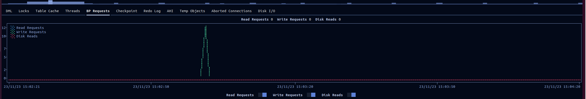

# MariaDB semi-sync replication using containers
## Anel Husakovic,
## Zenica, Novembar, 2023

<!-- vscode-markdown-toc -->
* [1. Standard replication configuration](#Standardreplicationconfiguration)
* [2. Standard replication transaction](#Standardreplicationtransaction)
* [3. Semi-sync replication configuration](#Semi-syncreplicationconfiguration)
* [4. Semi-sync replication transaction example](#Semi-syncreplicationtransactionexample)
* [5. Semi-sync demo example with containers](#Semi-syncdemoexamplewithcontainers)
	* [5.1 Check containers](#Checkcontainers)
		* [5.1.1 Check primary](#Checkprimary)
		* [5.1.2 Check binary logs](#Checkbinarylogs)
		* [5.1.3 Check replica[s]](#Checkreplicas)
	* [5.2 Start replicating](#Startreplicating)
		* [5.2.1 Create table](#Createtable)
		* [5.2.2 Insert data](#Insertdata)
		* [5.2.3 Check using GUI Dolphie](#CheckusingGUIDolphie)

<!-- vscode-markdown-toc-config
	numbering=false
	autoSave=false
	/vscode-markdown-toc-config -->
<!-- /vscode-markdown-toc -->

In the last blog [MariaDB replication using containers](https://mariadb.org/mariadb-replication-using-containers/), we showed how to properly replicate data in MariaDB using Docker containers.
We used standard or asynchronous or lazy replication.


The problem with this type of replication is potential data loss in case if primary goes
down. Transactions, that are commited on the primary, are not being send to replicas
and the replica doesn't commit the changes. Failover from primary to replica in this case,
may lead to missing transactions relative to the primary.

```mermaid
flowchart LR
   subgraph async["Standard (asynchronous) replication - primary failure"]
        direction LR
        %% Definitions
        app(("application"))
        primary[("MariaDB\nPrimary")]
        rep1[("MariaDB\nReplica 1")]
        rep2[("MariaDB\nReplica 2")]

        %% Connections
        primary ~~~|events ⛔|rep1 & rep2
        app-->|write ✅|primary
        primary-->|ack ✅|app
        %% Style color
        %% linkStyle 0,1 stroke:#321be0,stroke-width:4px,color:red;
        linkStyle 2 stroke:#03f0fc,stroke-width:4px,color:green;
        linkStyle 3 stroke:#fc036b,stroke-width:4px,color:blue;
    end
```


To overcome this type of errors, there is semi-sync replication and fully sync replication.
While in fully sync replication all replicas have to verify single transaction before primary 
returns to the session that executed the transaction in semi-sync type of replication at least one replica needs
to acknowledge transaction event that is transmitted successfully, that gives faster replication compared to the
fully-sync replication.
Compared to the async replication, semi-sync replication provides improved data integrity,
because when primary receives acknowledgment from at least one replica and commit the changes,
we can be sure data exists at least in 2 places.

```mermaid
flowchart LR
   subgraph async["Semi-sync replication"]
        direction LR
        %% Definitions
        app(("application"))
        primary[("MariaDB\nPrimary")]
        rep1[("MariaDB\nReplica 1")]
        rep2[("MariaDB\nReplica 2")]

        %% Connections
        primary--->|events|rep1 & rep2
        app-->|write ✅|primary
        primary-->|ack ✅|app
        rep1-.->|ack 📝✅|primary
        primary-.->|"wait ack ⏳\ncommit T1 ✅"|primary
        %% Style color
        linkStyle 0,1 stroke:#321be0,stroke-width:4px,color:red;
        linkStyle 2 stroke:#03f0fc,stroke-width:4px,color:green;
        linkStyle 3 stroke:#fc036b,stroke-width:4px,color:blue;
    end
```


In this blog we first explore:
1. how to setup semi-sync replication.

After that, for more curious readers we the will visualise in the form of graphs following:

2. Standard replication configuration
3. Standard replication transaction example
4. Semi-sync replication configuration
5. Semi-sync replication transaction example

## <a name='Semi-syncdemoexamplewithcontainers'></a>1. Semi-sync demo example with containers 
- In this example we will be using stateless application, just as a proof of concept.
- There is the [Docker compose](https://github.com/MariaDB/mariadb-docker/blob/master/examples/compose-replication-semisync.yml) file in our mariadb-docker repository.
- We will be using GTIDs, that are enabled automatically.
  This way replication will start at the position of the last GTID replicated to replica (seen from `gtid_slave_pos` system variable).

### <a name='Checkcontainers'></a>1.1 Check containers

- Start containers
```bash
$ docker compose -f compose-replication-semisync.yml up
```
- Check container statuses
```bash
$ docker ps
CONTAINER ID   IMAGE          COMMAND                  CREATED         STATUS                          PORTS      NAMES
1ddb1fa67fef   mariadb:lts    "docker-entrypoint.s…"   2 minutes ago   Up 2 minutes (healthy)          3306/tcp   mariadb-replica-2
dca7a79526ca   mariadb:lts    "docker-entrypoint.s…"   2 minutes ago   Up 2 minutes (healthy)          3306/tcp   mariadb-replica-1
addabd306bb4   mariadb:lts    "docker-entrypoint.s…"   2 minutes ago   Up 2 minutes (healthy)          3306/tcp   mariadb-primary
```

- Check logs


#### <a name='Checkprimary'></a>1.1.1 Check primary

- Check that semi-sync is enabled using `mariadb` client
```bash
$ docker exec -it mariadb-primary mariadb -uroot -psecret -e "select @@rpl_semi_sync_master_enabled;"
+--------------------------------+
| @@rpl_semi_sync_master_enabled |
+--------------------------------+
|                              1 |
+--------------------------------+
```

- Check [rpl_semi_sync_master_timeout](https://mariadb.com/kb/en/semisynchronous-replication/#rpl_semi_sync_master_timeout) variable (default 10[s]).
  When this time elapses and primary doesn't get any acknowledgment from replica, it switches back to asynchronous replication.
```bash
$ docker exec -it mariadb-primary mariadb -uroot -psecret -e "select @@rpl_semi_sync_master_timeout;"
+--------------------------------+
| @@rpl_semi_sync_master_timeout |
+--------------------------------+
|                          10000 |
+--------------------------------+
```

- Check master status
```bash
$ docker exec mariadb-primary mariadb -uroot -psecret -e "show master status\G;"
*************************** 1. row ***************************
            File: mariadb-bin.000002
        Position: 344
    Binlog_Do_DB: 
Binlog_Ignore_DB:
```

- Check databases for replication
```bash
$ docker exec -it mariadb-primary mariadb -uroot -psecret -e "show databases like '%test%'";
+-------------------+
| Database (%test%) |
+-------------------+
| testdb            |
+-------------------+
```

#### <a name='Checkbinarylogs'></a>1.1.2 Check binary logs
- There are 2 binary logs and index:
```bash
$ docker exec --workdir /var/lib/mysql mariadb-primary bash -c "ls maria*"
mariadb-bin.000001
mariadb-bin.000002
mariadb-bin.index
```

- The same can be seen from `mariadb` client:
```bash
$ docker exec mariadb-primary mariadb -uroot -psecret -e "show binary logs\G;"
*************************** 1. row ***************************
 Log_name: mariadb-bin.000001
File_size: 1166
*************************** 2. row ***************************
 Log_name: mariadb-bin.000002
File_size: 344
```

- You are free to inspect binary logs with `mariadb-binlog` client.
- Example of fresh start 
```bash
$ docker exec mariadb-primary mariadb-binlog /var/lib/mysql/mariadb-bin.000002
/*!50530 SET @@SESSION.PSEUDO_SLAVE_MODE=1*/;
/*!40019 SET @@session.max_delayed_threads=0*/;
/*!50003 SET @OLD_COMPLETION_TYPE=@@COMPLETION_TYPE,COMPLETION_TYPE=0*/;
DELIMITER /*!*/;
# at 4
#231123 12:21:47 server id 1  end_log_pos 256 CRC32 0x21866123 	Start: binlog v 4, server v 10.11.6-MariaDB-1:10.11.6+maria~ubu2204-log created 231123 12:21:47 at startup
# Warning: this binlog is either in use or was not closed properly.
ROLLBACK/*!*/;
BINLOG '
20NfZQ8BAAAA/AAAAAABAAABAAQAMTAuMTEuNi1NYXJpYURCLTE6MTAuMTEuNittYXJpYX51YnUy
MjA0LWxvZwAAAAAAAADbQ19lEzgNAAgAEgAEBAQEEgAA5AAEGggAAAAICAgCAAAACgoKAAAAAAAA
AAAAAAAAAAAAAAAAAAAAAAAAAAAAAAAAAAAAAAAAAAAAAAAAAAAAAAAAAAAAAAAAAAAAAAAAAAAA
AAAAAAAAAAAAAAAAAAAAAAAAAAAAAAAAAAAAAAAAAAAAAAAAAAAAAAAAAAAAAAAAAAAAAAAAAAAA
AAAAAAAAAAAEEwQADQgICAoKCgEjYYYh
'/*!*/;
# at 256
#231123 12:21:47 server id 1  end_log_pos 299 CRC32 0xdd5f27d6 	Gtid list [0-1-5]
# at 299
#231123 12:21:47 server id 1  end_log_pos 344 CRC32 0xca6cbf75 	Binlog checkpoint mariadb-bin.000002
DELIMITER ;
# End of log file
ROLLBACK /* added by mysqlbinlog */;
/*!50003 SET COMPLETION_TYPE=@OLD_COMPLETION_TYPE*/;
/*!50530 SET @@SESSION.PSEUDO_SLAVE_MODE=0*/;
```

- When creating the table and inserting the values, we updated 
```bash

```

#### <a name='Checkreplicas'></a>1.1.3 Check replica[s]
- Check replica semi-sync status (let's check just single replica)
```bash
$ docker exec -it mariadb-replica-2 mariadb -uroot -psecret -e "select @@rpl_semi_sync_slave_enabled;"
+-------------------------------+
| @@rpl_semi_sync_slave_enabled |
+-------------------------------+
|                             1 |
+-------------------------------+
```
- Check replicated database
```bash
$ docker exec -it mariadb-replica-1 mariadb -uroot -psecret -e "show databases like '%test%'";
+-------------------+
| Database (%test%) |
+-------------------+
| testdb            |
+-------------------+

$ docker exec -it mariadb-replica-2 mariadb -uroot -psecret -e "show databases like '%test%'";
+-------------------+
| Database (%test%) |
+-------------------+
| testdb            |
+-------------------+
```

### <a name='Startreplicating'></a>1.2 Start replicating

#### <a name='Createtable'></a>1.2.1 Create table

##### 1.2.1.1 Primary
- Transaction T1: `create table t(t int);`
- Status
```bash
MariaDB [testdb]> show master status;
+--------------------+----------+--------------+------------------+
| File               | Position | Binlog_Do_DB | Binlog_Ignore_DB |
+--------------------+----------+--------------+------------------+
| mariadb-bin.000003 |      485 |              |                  |
+--------------------+----------+--------------+------------------+
1 row in set (0.000 sec)
```

##### 1.2.1.2 Binlog
- Binlog (GTID `0-1-6`)
```bash
$ docker exec mariadb-primary mariadb-binlog /var/lib/mysql/mariadb-bin.000003
#231123 12:57:18 server id 1  end_log_pos 299 CRC32 0x0f7f30b3 	Gtid list [0-1-5]
# at 299
#231123 12:57:18 server id 1  end_log_pos 344 CRC32 0x263247e6 	Binlog checkpoint mariadb-bin.000003
# at 344
#231123 14:05:49 server id 1  end_log_pos 386 CRC32 0x9f9ba209 	GTID 0-1-6 ddl
/*!100101 SET @@session.skip_parallel_replication=0*//*!*/;
/*!100001 SET @@session.gtid_domain_id=0*//*!*/;
/*!100001 SET @@session.server_id=1*//*!*/;
/*!100001 SET @@session.gtid_seq_no=6*//*!*/;
# at 386
#231123 14:05:49 server id 1  end_log_pos 485 CRC32 0xb88ff6c5 	Query	thread_id=821	exec_time=0	error_code=0	xid=1678
use `testdb`/*!*/;
SET TIMESTAMP=1700748349/*!*/;
SET @@session.pseudo_thread_id=821/*!*/;
SET @@session.foreign_key_checks=1, @@session.sql_auto_is_null=0, @@session.unique_checks=1, @@session.autocommit=1, @@session.check_constraint_checks=1, @@session.sql_if_exists=0, @@session.explicit_defaults_for_timestamp=1, @@session.system_versioning_insert_history=0/*!*/;
SET @@session.sql_mode=1411383296/*!*/;
SET @@session.auto_increment_increment=1, @@session.auto_increment_offset=1/*!*/;
/*!\C utf8mb3 *//*!*/;
SET @@session.character_set_client=utf8mb3,@@session.collation_connection=33,@@session.collation_server=45/*!*/;
SET @@session.lc_time_names=0/*!*/;
SET @@session.collation_database=DEFAULT/*!*/;
create table t(t int)
/*!*/;
DELIMITER ;
# End of log file
ROLLBACK /* added by mysqlbinlog */;
/*!50003 SET COMPLETION_TYPE=@OLD_COMPLETION_TYPE*/;
/*!50530 SET @@SESSION.PSEUDO_SLAVE_MODE=0*/;
```

##### 1.2.1.3 Replica
```bash
$ docker exec -it mariadb-replica-2 mariadb -uroot -psecret -e "use testdb; show tables; show create table t;"
+------------------+
| Tables_in_testdb |
+------------------+
| t                |
+------------------+
+-------+------------------------------------------------------------------------------------------------------------------+
| Table | Create Table                                                                                                     |
+-------+------------------------------------------------------------------------------------------------------------------+
| t     | CREATE TABLE `t` (
`t` int(11) DEFAULT NULL
) ENGINE=InnoDB DEFAULT CHARSET=utf8mb4 COLLATE=utf8mb4_general_ci |
+-------+------------------------------------------------------------------------------------------------------------------+
MariaDB [(none)]> show replica status \G
*************************** 1. row ***************************
            Slave_IO_State: Waiting for master to send event
            Master_Host: mariadb-primary
            Master_User: repl
            Master_Port: 3306
            Connect_Retry: 10
        Master_Log_File: mariadb-bin.000003
    Read_Master_Log_Pos: 485
            Relay_Log_File: mariadb-relay-bin.000002
            Relay_Log_Pos: 786
    Relay_Master_Log_File: mariadb-bin.000003
        Slave_IO_Running: Yes
        Slave_SQL_Running: Yes
    Replicate_Rewrite_DB: 
        Replicate_Do_DB: 
    Replicate_Ignore_DB: 
        Replicate_Do_Table: 
    Replicate_Ignore_Table: 
Replicate_Wild_Do_Table: 
Replicate_Wild_Ignore_Table: 
                Last_Errno: 0
                Last_Error: 
            Skip_Counter: 0
    Exec_Master_Log_Pos: 485
        Relay_Log_Space: 1097
        Until_Condition: None
            Until_Log_File: 
            Until_Log_Pos: 0
        Master_SSL_Allowed: No
        Master_SSL_CA_File: 
        Master_SSL_CA_Path: 
        Master_SSL_Cert: 
        Master_SSL_Cipher: 
            Master_SSL_Key: 
    Seconds_Behind_Master: 0
Master_SSL_Verify_Server_Cert: No
            Last_IO_Errno: 0
            Last_IO_Error: 
            Last_SQL_Errno: 0
            Last_SQL_Error: 
Replicate_Ignore_Server_Ids: 
        Master_Server_Id: 1
            Master_SSL_Crl: 
        Master_SSL_Crlpath: 
                Using_Gtid: Slave_Pos
            Gtid_IO_Pos: 0-1-6
Replicate_Do_Domain_Ids: 
Replicate_Ignore_Domain_Ids: 
            Parallel_Mode: optimistic
                SQL_Delay: 0
    SQL_Remaining_Delay: NULL
Slave_SQL_Running_State: Slave has read all relay log; waiting for more updates
        Slave_DDL_Groups: 1
Slave_Non_Transactional_Groups: 0
Slave_Transactional_Groups: 0
1 row in set (0.000 sec)
```

#### <a name='Insertdata'></a>1.2.2 Insert data

##### 1.2.2.1 Primary
- Transaction T2: `insert into t values (1),(2),(314),(1618);`
- Status
```bash
MariaDB [testdb]> show master status;
+--------------------+----------+--------------+------------------+
| File               | Position | Binlog_Do_DB | Binlog_Ignore_DB |
+--------------------+----------+--------------+------------------+
| mariadb-bin.000003 |      668 |              |                  |
+--------------------+----------+--------------+------------------+
1 row in set (0.000 sec)
```

##### 1.2.2.2 Binlog

- `GTID 0-1-7`
```bash
# at 485
#231123 14:46:19 server id 1  end_log_pos 527 CRC32 0x9ef73274 	GTID 0-1-7 trans
/*!100001 SET @@session.gtid_seq_no=7*//*!*/;
START TRANSACTION
/*!*/;
# at 527
#231123 14:46:19 server id 1  end_log_pos 637 CRC32 0xaafb199a 	Query	thread_id=821	exec_time=0	error_code=0	xid=0
SET TIMESTAMP=1700750779/*!*/;
insert into t values (1),(2),(314),(1618)
/*!*/;
# at 637
#231123 14:46:19 server id 1  end_log_pos 668 CRC32 0xb4fb80ec 	Xid = 2644
COMMIT/*!*/;
DELIMITER ;
# End of log file
```

##### 1.2.2.3 Replica

```bash
$ docker exec -it mariadb-replica-2 mariadb -uroot -psecret -e "select * from testdb.t"
+------+
| t    |
+------+
|    1 |
|    2 |
|  314 |
| 1618 |
+------+
# Replica status changes
MariaDB [(none)]> show replica status \G
                Slave_IO_State: Waiting for master to send event
               Master_Log_File: mariadb-bin.000003
           Read_Master_Log_Pos: 668
                Relay_Log_File: mariadb-relay-bin.000002
                 Relay_Log_Pos: 969
           Exec_Master_Log_Pos: 668
               Relay_Log_Space: 1280
                    Using_Gtid: Slave_Pos
                   Gtid_IO_Pos: 0-1-7
       Slave_SQL_Running_State: Slave has read all relay log; waiting for more updates
```

#### <a name='CheckusingGUIDolphie'></a>1.2.3 Check using GUI Dolphie
- I wanted to check [doplhie](https://github.com/charles-001/dolphie), so I installed it on my primary container:
```bash
apt-get update && \
apt-get -y install python3-pip && \
pip install dolphie
```
- There is very nice GUI, but it supports MySQL's group replication only





## <a name='Standardreplicationconfiguration'></a>2. Standard replication configuration
To configure the standard replication implemented in previous blog was straight forward:


## <a name='Standardreplicationtransaction'></a>3. Standard replication transaction

On thread level (see [replication-threads](https://mariadb.com/kb/en/replication-threads/)),flow of active transaction we can express as following:


Type of the replication is asynchronous that means that we don't have any feedback information from replicas,
that event has been successfully received by replica, as can be seen from picture.

## <a name='Semi-syncreplicationconfiguration'></a>4. Semi-sync replication configuration
Before confirming the client request, at least one replica has to confirm receipment of data changes (IO thread),
not that actually replica applied those data changes.
To configure the semi-sync replication we need to stop replicase and set environment variables on primary and replicas.
On primary set `rpl_semi_sync_master_enabled` and on replicas set `rpl_semi_sync_slave_enabled`.
If things are correctly set `rpl_semi_sync_master_status` and `rpl_semi_sync_slave_status` should be on 
for their respective servers.
We will show just updatedt configuration compared to the section 2.


## <a name='Semi-syncreplicationtransactionexample'></a>5. Semi-sync replication transaction example
Semi-sync should overcome that problem, with introducing additional primary thread , called ["ACK Receiver Thread"](https://mariadb.com/kb/en/replication-threads/#ack-receiver-thread).
Only one replica is needed to confirm, that it has received and logged the events, as showed on following picture:


## Conclusion and further readings
Special thanks Brandon Nesterenko, Daniel Black and Ian Gilfillan  for reviewing this blog post.
TODO Say a word about [MDEV-21322](https://jira.mariadb.org/browse/MDEV-21322) ?
If you come across any problems in this blog, with the design, or edge cases that don’t work as expected, please let us know. You are welcome to chat about it on Zulip. As always you can use our JIRA bug/feature request in the MDEV project for any bug/feature request you may encounter.

- This blog closes [MDBF](https://jira.mariadb.org/browse/MDBF-573). (this will not be part of the blog)


// Not working https://github.com/mermaid-js/mermaid/issues/821