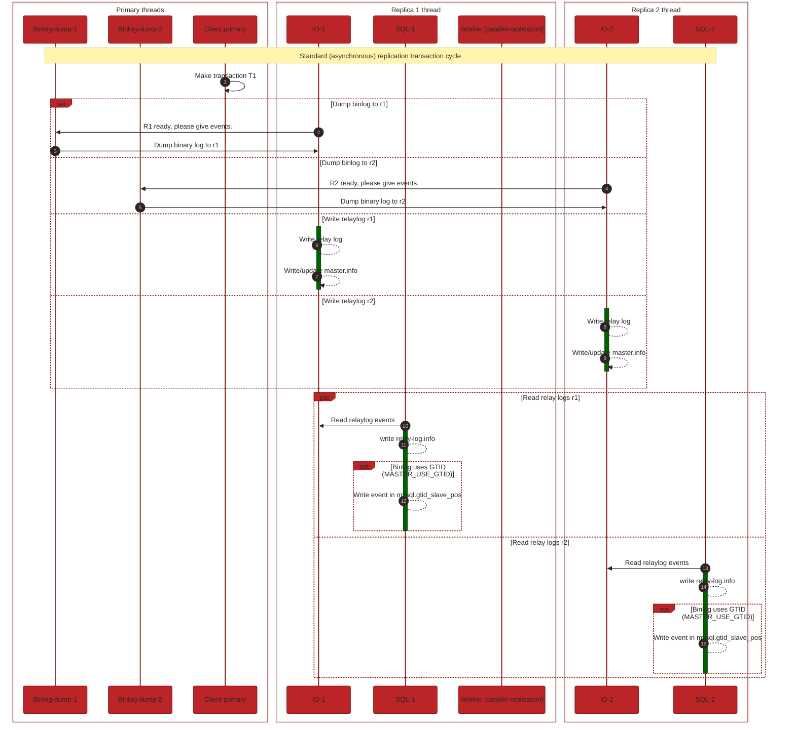
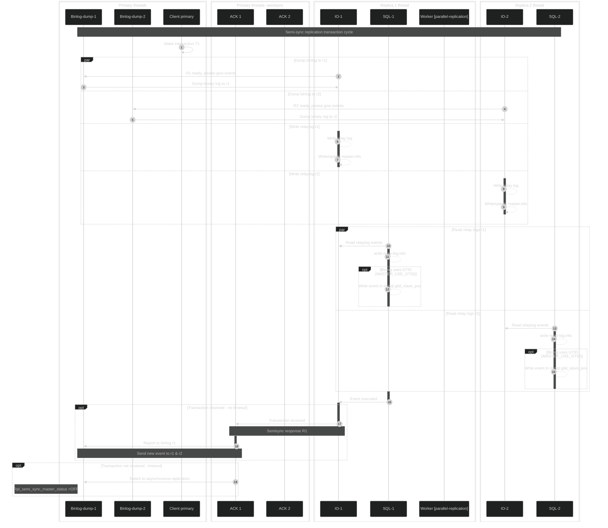

# MariaDB semi-sync replication using containers

In the last blog [MariaDB replication using containers](https://mariadb.org/mariadb-replication-using-containers/)
we showed how to properly replicate data in MariaDB using Docker containers.
We used standard or asynchronous or lazy replication.

In this blog we will visualise following:

1. Standard replication configuration
2. Standard replication transaction example
3. Semi-sync replication configuration
4. Semi-sync replication transaction example
5. Semi-sync demo example

## 1. Standard replication configuration
To configure the standard replication implemented in previous blog was straight forward:

## 2. Standard replication transaction

On thread level (see [replication-threads](https://mariadb.com/kb/en/replication-threads/)),flow of active transaction we can express as following:

Type of the replication is asynchronous that means that we don't have any feedback information from replicas,
that event has been successfully received by replica, as can be seen from picture.

## 3. Semi-sync replication configuration
To configure the semi-sync replication we need to stop replicase and set environment variables on primary and replicas.
On primary set `rpl_semi_sync_master_enabled` and on replicas set `rpl_semi_sync_slave_enabled`.

## 4. Semi-sync replication transaction example
Semi-sync should overcome that problem, with introducing additional primary thread , called ["ACK Receiver Thread"](https://mariadb.com/kb/en/replication-threads/#ack-receiver-thread).
Only one replica is needed to confirm, that it has received and logged the events, as showed on following picture:

## 5. Semi-sync demo example with containers
We will be using GTIDs as promised in last blog.

- Not related to the blog - part of the [MDBF](https://jira.mariadb.org/browse/MDBF-573). (this will not be part of the blog)