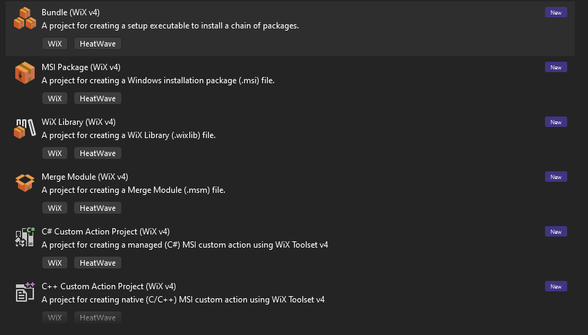

# Getting started with Wix
Following
https://wixtoolset.org/docs/intro/
- Wix toolset
  - Creates:
    1) MSI (Microsoft Installer) .msi
    2) MSM (Merge modules) .msm
    3) MSP (patches) .mps
    4) MST (transforms) .mst
  - Wix VS package procvides templates
    1. Wix Project
    2. Wix Library Project
    3. Wix Merge Module Project


- There is Heatwave downlaod for VS2022 wix [here](https://marketplace.visualstudio.com/items?itemName=FireGiant.FireGiantHeatWaveDev17)

```bash
> dotnet tool install --global wix
Skipping NuGet package signature verification.

>wix --version
4.0.4+a8592982
```
## Official Wix3 tutorial
[Tutorial](https://www.firegiant.com/docs/wix/v3/tutorial/)


##  MariaDB
```bash
$ find .|grep wxs
./win/packaging/extra.wxs.in
./win/packaging/mysql_server.wxs.in
```
- Noted that there is `win/packaging/CMakeLists.txt` that defines cmake variables
  - it configure_file `create_msi.cmake.in` as `bin/create_msi.cmake` that maps Cmake variables
    - The same file compiles `.wxs` files (`mysql_server.wxs` and `extra.wxs`) with `candle` into 
      `mysql_server.wixobj` and `extra.wixobj`.
    - Above files are linked with `light` into `CPACK_PACKAGE_FILE_NAME.msi` that is copied to `/bin`
      - Note that `CPACK_PACKAGE_FILE_NAME` is in `CPackWixConfig.cmake` that is used to set `CPACK_WIX_CONFIG`.

  - Those mapped cmake variables are used in `mysql_server.wxs.in`
All started with commit [e353bc80f721](https://github.com/mariadb/server/commit/e353bc80f721)

- To build MSI using WiX (Windows installer from XML files) with Wix4 doesn't work:
```bash
# Compile 
$ cmake ../server -A x64 -DPLUGIN_ROCKSDB=NO -DPLUGIN_HASHICORP_KEY_MANAGEMENT=NO -DWITH_UNIT_TESTS=0 -DMYSQL_MAINTAINER_MODE=ERR -Wno-dev

# Build
$ cmake --build  .  --verbose --config RelWithDebInfo -- -m
Build succeeded.
    0 Warning(s)
    0 Error(s)

Time Elapsed 00:03:10.25

# Create MSI packge
$ cmake --build  . --verbose --config RelWithDebInfo --target MSI -- -m
Change Dir: 'C:/Users/anel_/OneDrive/Desktop/anel/bld'

Run Build Command(s): "C:/Program Files/Microsoft Visual Studio/2022/Community/MSBuild/Current/Bin/amd64/MSBuild.exe" MSI.vcxproj /p:Configuration=RelWithDebInfo /p:Platform=x64 /p:VisualStudioVersion=17.0 /v:n -m
MSBuild version 17.9.5+33de0b227 for .NET Framework
MSBUILD : error MSB1009: Project file does not exist.
Switch: MSI.vcxproj

$ dotnet tool install --global wix
$ wix --version
4.0.4+a8592982

$ where wix
C:\Users\anel_\.dotnet\tools\wix.exe
```

- When installed Wix3 (installer doesn't add into env PATH variable)
  - Installation [Wix3](https://github.com/wixtoolset/wix3/releases/tag/wix314rtm)
    `wix314.exe is the installer`.
  - [Wix3 documentation](https://wixtoolset.org/docs/v3/)

```bash
# Add path to env variables
# $ C:\Program Files (x86)\WiX Toolset v3.14\bin
$ where candle
C:\Program Files (x86)\WiX Toolset v3.14\bin\candle.exe
# Note it didn't work with pcre and vcpkg

# Had to start new build
 1>PrepareForBuild:
         Creating directory "x64\RelWithDebInfo\MSI\".
         Structured output is enabled. The formatting of compiler diagnostics will reflect the error hierarchy. See htt
         ps://aka.ms/cpp/structured-output for more details.
         Creating directory "x64\RelWithDebInfo\MSI\MSI.tlog\".
       InitializeBuildStatus:
         Creating "x64\RelWithDebInfo\MSI\MSI.tlog\unsuccessfulbuild" because "AlwaysCreate" was specified.
         Touching "x64\RelWithDebInfo\MSI\MSI.tlog\unsuccessfulbuild".
       CustomBuild:
         -- CPACK_COMPONENTS_ALL=Backup;Client;ClientPlugins;Common;Debuginfo;Development;Readme;Server;Server_Scripts;
         SharedLibraries;SqlBench;Test;connect-engine
         -- add_component : ignoring VCCRT, not in CPACK_COMPONENTS_ALL
         -- add_component : ignoring connect-engine-jdbc, not in CPACK_COMPONENTS_ALL
         -- add_component : ignoring aws-key-management, not in CPACK_COMPONENTS_ALL
         -- add_component : ignoring rocksdb-engine, not in CPACK_COMPONENTS_ALL
         -- add_component : ignoring plugin-hashicorp-key-management, not in CPACK_COMPONENTS_ALL
         Windows Installer XML Toolset Compiler version 3.14.0.8606
         Copyright (c) .NET Foundation and contributors. All rights reserved.

         mysql_server.wxs
         Windows Installer XML Toolset Compiler version 3.14.0.8606
         Copyright (c) .NET Foundation and contributors. All rights reserved.

         extra.wxs
         Windows Installer XML Toolset Linker version 3.14.0.8606
         Copyright (c) .NET Foundation and contributors. All rights reserved.

         Updating file information.
         Creating cabinet files.
         There will be '6' threads used to produce CAB files.
         Creating cabinet 'C:\Users\anel_\OneDrive\Desktop\anel\bld2\win\packaging\#cab30.cab'.

```
- `mariadb-11.4.0-winx64` can be found in `<build>\win\packaging` directory

- Sources of MSI "generator" `win\packaging`
- cmake scripts that generate wix source files, then wix compiler and linker runs

[WIX Tool set](https://www.youtube.com/watch?v=pcEEOKAyGJ8)
[Creating MSI file using WIX Toolset using VS 2022](https://www.youtube.com/watch?v=VDQDJWkY9oo)
[About chockolate](https://www.youtube.com/watch?v=1N5lyQIvot4&list=PL6vR1GM9joBYM1fKOJc4h629q2c52fgqg&index=7)
[Wix 4 CLI: Crete VSC MIS installation file](https://www.youtube.com/watch?v=9hvCl7FJFJw)
[wix-toolser-4-cli-GitHub](https://github.com/letsdoautomation/wix-toolset-4-cli/tree/main/Create%20Visual%20Studio%20Code%20MSI%20installation%20file)
